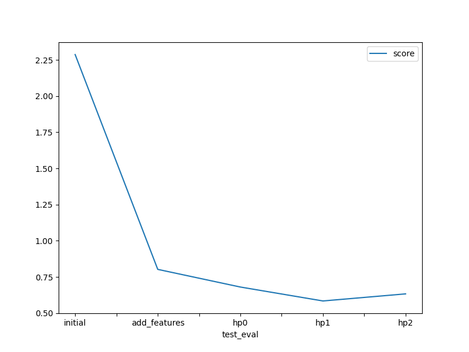

# Report: Predict Bike Sharing Demand with AutoGluon Solution
#### Stefano Emilio Campanini

## Initial Training
### What did you realize when you tried to submit your predictions? What changes were needed to the output of the predictor to submit your results?
What I learnt was the need to cleanup from the predictions the negative values. 
We are predicting a _count_ so it has to be zero or positive.

### What was the top ranked model that performed?
Autogluon best model was _WeightedEnsemble_L3_ , Kaggle score on _test_ data was about 1.78497 ( Kaggle uses Root Mean Squared Logarithmic Error (RMSLE) ).

## Exploratory data analysis and feature creation
### What did the exploratory analysis find and how did you add additional features?
I added the _hours_ of the day, extracted from the absolute date-time of the samples. 
In the EDA histogram it is possible to note that the _count_ is almost constant during the day with the exception of 4 moments/times in the day.  
Keeping the _hours_ separated from the date-time helps the model to find/use this correlation.

Another hint, to the models traning/selection, for AutoGluon has been the use of the _categorical type_ explicited for some features. In this way we were adding suggestions for AutoGluon to treat these as category and not an amount.

Also the feature _casual_ and _registered_ was dropped not useful for the model.

### How much better did your model preform after adding additional features and why do you think that is?
Autogluon best model was _WeightedEnsemble_L3_ , Kaggle score moved from about 1.78 to about. 0.80.

## Hyper parameter tuning
### How much better did your model preform after trying different hyper parameters?
My knowledge of the models used by Autogluon is limited, not easy for me to decide what to do. 

I tryed 3 different set of hyperparamteres only with the improvements only using the _rich set of features_ just created. 
I was not able to get a really better score, but the exercise was useful to learn howto set these in hyper parameters Autogluon.

### If you were given more time with this dataset, where do you think you would spend more time?
One thing, I would try is to check and think better about the data using EDA in order to find some hints for features selection or engineering. 

For example:
* set _holiday_ and _working day_ as categorical like doen for the _hours_,
* go deeper about preprocessing features, _winsorization_ outliers and/or _standardization_ or/and _normalization_ of features, 
    * _normalization_ for the ones that follow gaussian distribution,
    * _standardization_ for others

Others directions:
* study howto use RMSLE as evaluation (or extra) metric for Autogluon, I tryed but is not supported out-of-box for regression problem type
* try the _TimeSeriesPredictor_ , this seems in some ways a time serie problem.

### Create a table with the models you ran, the hyperparameters modified, and the kaggle score.

You can find the details of the valued of hyperparameters used in the notebook. Putting these in the table was creating some mess.

#### Train data predictions scores
|model|score|
|--|--|
|initial|2.28671|
|add_features-no-optimization|2.03946|
|hp0|1.83376|
|hp1|1.97335|
|hp2|1.87625|

#### Test data predictions scores
|model|score|
|--|--|
|initial|1.78497|
|add_features-no-optimization|0.80276|
|hp0|0.68077|
|hp1|0.58452|
|hp2|0.63345|

### Create a line plot showing the top model score for the three (or more) training runs during the project.

### Create a line plot showing the top kaggle score for the three (or more) prediction submissions during the project.

## Summary
I found AutoGluon a real powerful way to arrive immediately to a good enough model. 
Anyway working on EDA and study how to engineer the features has the higher value. 
I am learning and this is my first project in this field, one useful thing I learnt is howto partecipate to a Kaggle competition. 
This is an opening the doors for me, I can work on real problems and having a score as feedback, also without having a job as Machine learning Egineer.

